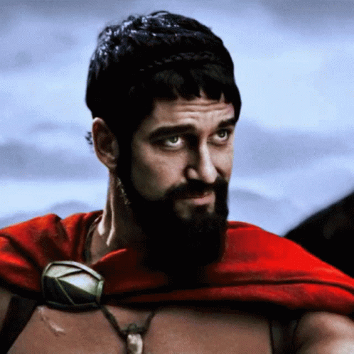
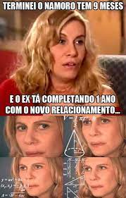
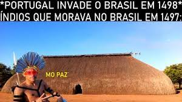

# **Os principais memes brasileiros**

Irei mostra um pouco dos melhores memes brasileiros na minha opinião 

# **Um pouco** ➕

O meme **_um pouco mais_** surgiu com humorista Thiago Ventura,no seu show [Tigas e os 300 de Esparta](https://youtube.com/embed/u548qyxRTBU). Nele, o ator narra como agiria se fizesse parte do exército espartano, do filme 300. O vídeo viralizou e ganhou uma versão na qual o áudio de Ventura é sobreposto a uma cena do longa-metragem. Um frame dessa paródia, com o rosto do ator Gerard Butler, intérprete do rei Leônidas, passou a ser usado em várias piadas na rede.

 

 
Um frame dessa paródia, com o rosto do ator Gerard Butler, intérprete do rei Leônidas, passou a ser usado em várias piadas na rede. Como por exemplo:

 

 

# **Nazaré confusa**❓❓

O meme surgiu após as pessoas começarem a usar imagem da vilã pensando, com um olhar perdido,sempre que alguém se sentia desnorteado ou não entendia algo. As versões mais populares desse meme são em GIF :

 

E fotos:

 

 

# **Mo paz** 😎🏳

O meme **mo paz** surge após o Mc Poze do rodo ompartilhar um vídeo em suas redes sociais que deu origem ao meme Mó paz,onde ele dentro da piscina, com um copo de cerveja na mão,diz: **_"Aah, mó paz! Como é que 'nós tá'? Tranquilão com a vida, graças a Deus"_**. Com isso começou surgi farias memes como:

 

 

# **O pai ta on** 😎

Não se sabe bem ao certo onde a expressão surgiu, mas ela caiu no gosto do povo depois de um tweet do jogador de futebol Neymar. Ela Pode significar que a pessoa está na ativa, disposta e até mesmo disponível (vulgo solteira).

 

 

# **Meme da Pfizer (Pifaizer)** 🏥

Criado pelo humorista Esse Menino, o [vídeo](https://youtu.be/rWj9meqOQrM) que ficou conhecido como meme da Pfizer caiu no gosto do povo. Na esquete, o ator se passa pela marca Pfizer tentando entrar em contato com o presidente do Brasil Jair Bolsonaro.

  <h1>Referencia</h1>

[Dicionariopopular](https://www.dicionariopopular.com/melhores-memes-do-ano/)

